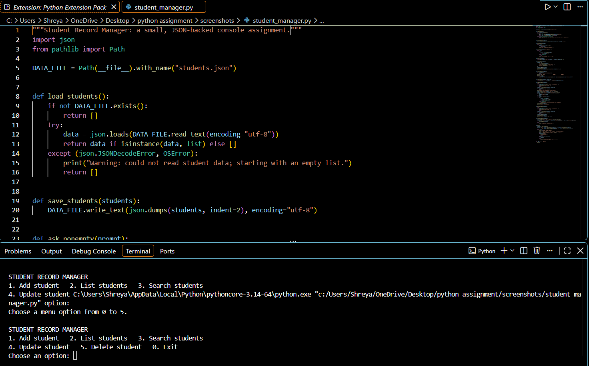

# Student Record Manager

A beginner-friendly Python console assignment for managing student records. It supports adding, listing, searching, updating, and deleting student records. Records are saved in `students.json` beside the program, so they remain available after the program exits.

## Requirements

- Python 3.9 or newer
- No third-party packages

## Run it

```bash
python student_manager.py
```

Choose a menu number and follow the prompts. Use `0` to exit. Marks must be between 0 and 100. You can press Enter during an update to keep the current field value.

## Example console run

The screenshot below shows output from a real run of the program using sample student data.



## Features

- Add student records with automatically assigned IDs
- Display all saved students in a table
- Search names and courses without case sensitivity
- Update one or more fields while retaining other values
- Delete a record by ID
- Validate required text, numeric IDs, and marks
- Persist data in a readable JSON file

## Files

- `student_manager.py` - application source code
- `students.json` - created automatically when the first record is added
- `screenshots/student-manager-console.png` - sample application run screenshot
- `ASSIGNMENT_DOCUMENTATION.pdf` - assignment overview and usage documentation

## Documentation

See [ASSIGNMENT_DOCUMENTATION.pdf](ASSIGNMENT_DOCUMENTATION.pdf) for the full assignment guide.

## Learning outcomes

This assignment practices functions, lists and dictionaries, loops, conditionals, input validation, JSON file handling, and decomposition of a program into small tasks.


